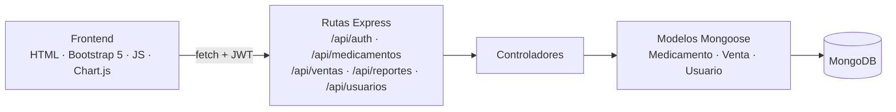

<div align="center">

# 💊 Farmacia · Inventario y Facturación

### Aplicación web para el control de medicamentos, ventas y reportes de una farmacia, diseñada con criterios de usabilidad y accesibilidad

[](https://nodejs.org/)
[](https://expressjs.com/)
[](https://mongoosejs.com/)
[](https://jwt.io/)
[](https://getbootstrap.com/)
[](https://www.chartjs.org/)

</div>

---

## 📖 Descripción

Sistema web para farmacias que integra **inventario de medicamentos**, **registro de ventas** y **reportes financieros** en un dashboard con gráficos. El proyecto se desarrolló en la asignatura **Usabilidad**, por lo que la interfaz prioriza navegación por teclado, formularios con validación y mensajes claros, y un diseño responsive.

## ✨ Funcionalidades

- 🔐 **Autenticación con JWT** y contraseñas cifradas con **bcrypt**; roles: administrador, farmacéutico y vendedor.
- 💊 **Medicamentos:** registro, listado, valor total del inventario y **alertas de vencimiento**.
- 🧾 **Ventas:** registro de ventas y resumen de ventas del día.
- 📊 **Reportes:** inventario, ventas, reporte financiero y productos más vendidos.
- 📈 **Dashboard** con gráficos interactivos (Chart.js).
- 👥 **Usuarios:** administración completa de cuentas.

## 🏗️ Arquitectura



```
├── backend/
│   ├── server.js          # Express, CORS, morgan, conexión a MongoDB
│   ├── routes/            # Definición de endpoints por módulo
│   ├── controllers/       # Lógica de negocio
│   ├── models/            # Esquemas Mongoose
│   └── public/            # Vistas servidas por el backend
└── frontend/
    ├── login.html, dashboard.html, medicamentos.html, ventas.html, reportes.html
    ├── css/
    └── js/                # Un módulo por pantalla
```

## 🔌 API

| Método | Ruta | Descripción |
|---|---|---|
| POST | `/api/auth/login` | Inicio de sesión, devuelve JWT |
| GET · POST | `/api/medicamentos` | Listar / registrar medicamentos |
| GET | `/api/medicamentos/alertas` | Medicamentos próximos a vencer |
| GET | `/api/medicamentos/total` | Valor total del inventario |
| GET · POST | `/api/ventas` | Listar / registrar ventas |
| GET | `/api/ventas/dia` | Ventas del día |
| GET | `/api/reportes/inventario` · `/ventas` · `/financiero` · `/mas-vendidos` | Reportes |
| GET · POST · PUT · DELETE | `/api/usuarios` | Gestión de usuarios |

## 🚀 Ejecución local

```bash
cd backend
npm install
cp .env.example .env      # configurar MONGO_URI y JWT_SECRET
npm run dev               # http://localhost:3000
```

## 👤 Autor

**Marco Adrián Padilla Triviño** · Estudiante de Ingeniería de Software, Universidad de las Fuerzas Armadas ESPE

[](https://github.com/Adrizzx)
